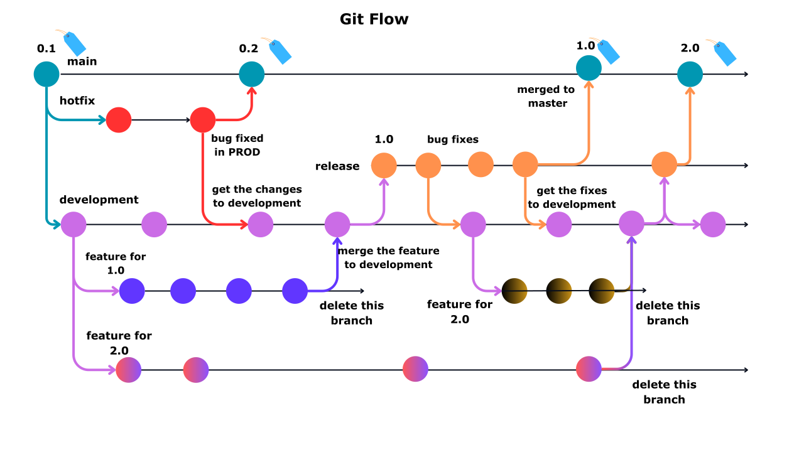
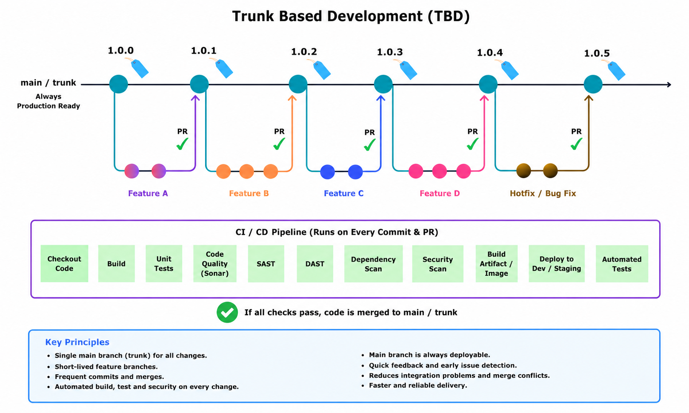

# 🌿 Branching Strategies

A well-defined branching strategy is essential for maintaining a clean, organized, and manageable codebase. It helps development teams collaborate efficiently while ensuring code quality, stability, and faster software delivery.

## Why Use a Branching Strategy?

- Parallel Development
- Code Stability
- Code Reviews & Collaboration
- CI/CD Integration
- Faster Releases
- Easier Bug Fixing
- Better Version Control

---

## Branching Models Covered

### 1. Git Flow

Git Flow is a structured branching model that uses dedicated branches for features, releases, and hotfixes. It is well-suited for projects with scheduled releases.

<p align="center">
  
</p>

📄 Detailed Guide: [Git Flow](git-flow.md)

---

### 2. Feature Branching

Feature Branching allows developers to work on isolated branches for each feature or bug fix. Changes are merged into the main branch through Pull Requests after review and validation.

<p align="center">
  
</p>

📄 Detailed Guide: [Feature Branching](feature.md)

---

### 3. Trunk-Based Development (TBD)

Trunk-Based Development encourages frequent integration of small changes into a single main branch. Short-lived branches and continuous integration help teams deliver software faster and reduce merge conflicts....

<p align="center">
  
</p>

📄 Detailed Guide: [Trunk-Based Development](trunk-based.md)

---

## Comparison

| Strategy | Best For | Branch Lifetime | Release Frequency |
|-----------|-----------|-----------------|------------------|
| Git Flow | Enterprise & Scheduled Releases | Long | Low to Medium |
| Feature Branching | Team Collaboration | Medium | Medium |
| Trunk-Based Development | Continuous Delivery | Short | High |

---

## Repository Structure

```text
branching-strategy/
├── README.md
├── feature.md
├── git-flow.md
├── trunk-based.md
│
└── images/
    ├── feature.svg
    ├── git-flow.svg
    └── trunk-based.png
```

---

## Key Takeaways

✅ Git Flow provides strong release control.

✅ Feature Branching improves collaboration and code review.

✅ Trunk-Based Development enables faster delivery and continuous integration.

✅ Choose the branching strategy that best aligns with your team's development and release process.