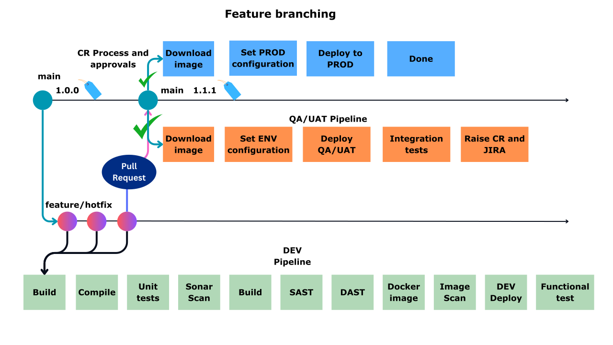

# Git Flow Branching Strategy

## Overview

Git Flow is a branching strategy designed to manage feature development, releases, and production hotfixes in a structured manner. It provides clear separation between ongoing development, release preparation, and production maintenance, making it suitable for enterprise software delivery.

<p align="center">
  
</p>
---

## Branch Types

### Main Branch

The `main` branch contains production-ready code.

```text
main
├── v0.1
├── v0.2
├── v1.0
└── v2.0
```

Only tested and approved releases are merged into the main branch.

---

### Development Branch

The `development` branch serves as the integration branch where all completed features are merged before creating a release.

```text
main
  │
  └── development
```

All new feature branches originate from the development branch.

---

### Feature Branches

Feature branches are created from the development branch for implementing new functionality.

Examples:

```text
feature/1.0
feature/2.0
```

Development activities include:

- Coding
- Unit Testing
- Code Review
- Security Validation
- Functional Testing

After completion, feature branches are merged back into the development branch.

```text
feature branch
      │
      ▼
development
```

Once merged successfully, the feature branch is deleted.

---

### Release Branches

When enough features are ready, a release branch is created from development.

Example:

```text
release/1.0
```

The release branch is used for:

- Final testing
- Bug fixing
- User Acceptance Testing (UAT)
- Release validation
- Performance testing

Only release-related fixes are allowed in this branch.

---

### Production Release

After successful validation, the release branch is merged into the main branch.

```text
release/1.0
      │
      ▼
main (v1.0)
```

A version tag is created to identify the production release.

Examples:

```text
v1.0
v2.0
```

---

## Hotfix Process

Hotfix branches are created directly from the main branch when critical production issues occur.

Example:

```text
main
  │
  └── hotfix/critical-bug
```

Typical scenarios:

- Application outage
- Security vulnerability
- Critical production defect
- Data corruption issue

---

### Hotfix Workflow

#### Step 1: Create Hotfix Branch

```text
main
  │
  └── hotfix
```

#### Step 2: Fix Production Issue

Developers implement the required fix.

#### Step 3: Merge into Main

The fix is merged back into the main branch and released immediately.

```text
hotfix
   │
   ▼
main
```

#### Step 4: Merge Back into Development

To prevent code divergence, the same fix must be merged into the development branch.

```text
hotfix
   │
   ▼
development
```

This ensures future releases contain the production fix.

---

## Release Lifecycle Example

### Version 1.0

1. Create feature branches from development.
2. Develop and test features.
3. Merge completed features into development.
4. Create release/1.0 branch.
5. Perform QA, UAT, and bug fixes.
6. Merge release/1.0 into main.
7. Tag release as v1.0.

---

### Production Bug Fix

1. Create hotfix branch from main.
2. Fix production issue.
3. Merge hotfix into main.
4. Tag new release version.
5. Merge hotfix changes into development.

---

### Version 2.0

1. Continue feature development in development branch.
2. Create feature branches for upcoming functionality.
3. Merge completed features into development.
4. Create release/2.0 branch.
5. Perform final validation.
6. Merge release/2.0 into main.
7. Tag release as v2.0.

---

## Complete Workflow

```text
Main
 ├── Production Releases
 ├── Version Tags
 └── Hotfixes

Development
 ├── Integration Branch
 ├── Feature Merges
 └── Release Preparation

Feature Branches
 ├── New Features
 ├── Enhancements
 └── Bug Fixes

Release Branches
 ├── QA Testing
 ├── UAT Validation
 └── Production Readiness

Hotfix Branches
 ├── Critical Production Fixes
 ├── Security Patches
 └── Emergency Releases
```

---

## Best Practices

- Keep the main branch always production-ready.
- Create feature branches from development only.
- Use release branches for final testing and stabilization.
- Create hotfix branches directly from main for urgent production fixes.
- Merge hotfix changes back into development.
- Delete feature and release branches after successful merges.
- Tag every production release with a version number.
- Enforce Pull Requests and code reviews for all merges.

---

## Benefits

✅ Clear separation of development and production code

✅ Parallel feature development

✅ Controlled release management

✅ Faster production hotfixes

✅ Improved traceability through version tags

✅ Reduced deployment risk

✅ Better collaboration across development, QA, and operations teams

✅ Suitable for enterprise DevOps and DevSecOps environments
````
